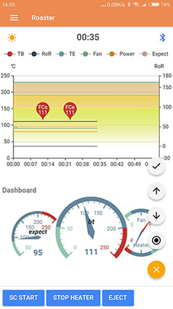
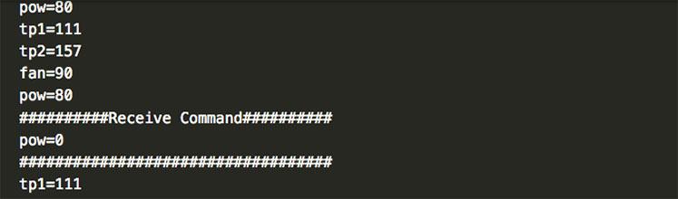

# PopRoast test
Arduino sketch，Test `PopRoast` app on Android/iOS.  
**PopRoast**：Receiving data on coffee roasting through Bluetooth, drawing chart in real time, and monitoring roasting conditions.  
Can also simply input the temperature to generate a chart.  
 
  
# app-bluetooth-test
The Arduino program generates test data that is sent via the Bluetooth module to the `PopRoast` App on the phone.
The transmitted data can be viewed on the Arduino's serial monitor. Receives the command string sent by the App and displays it on the serial monitor.
This program is for testing purposes only.


## Arduino Bluetooth module
* Android: Bluetooth module that supports Arduino is generally OK, I tried HC-02 (Bluetooth 2.0 + 4.0BLE version) and HC-05, it works  
* iOS: I use [HC-02](http://www.hc01.com/productdetail?productid=20180314021)(Bluetooth 2.0+4.0BLE version)  
For details, please refer to:    
https://github.com/don/BluetoothSerial#where-does-this-work

# poproast-demo
Measure temperature using the MAX31855 module and send it to the `PopRoast` App on the phone via the Bluetooth module. 

# Install
Just clone and install to your Arduino uno with bluetooth module.
[poproast-test](https://github.com/usb2win/poproaster-test)
:tada:

 * 如果喜欢它，请别忘了给我一颗鼓励的星
 * Support me a `Star` if it is necessary.  :+1:
 
# poproast-demo
If you want to use PopRoast to view the roasting chart, you may need to:
1. Arduino Uno
2. Bluetooth module: hc-05/06 for Android,hc-02 for Android/iOS
3. MAX31855  module: Temperature measurement
If you need to use the Arduino to control the coffee roasting process, you also need to use PWM to control the Fan level, and SSR to control the heating. This program does not include these contents.

# PopRoast data format
## Arduino send data format：
```
Bean temperature："tp1=xxx\n"
Environment temperature： "tp2=xxx\n"
Temperature3: "tp3=xxx\n"
Temperature4: "tp4=xxx\n"
Heating power："pow=xxx\n". Ranges: 0 ~ 100(%)
Fan level："fan=xxx\n". Ranges: 0 ~ 100(%)
Theoretical temperature："expect=xxx\n". If PID is used, it is the target temperature of PID
```

## `PopRoast` App send command format：
```
↑ ↓: Fan level increase or decrease，Each press to send "fan=xxx\n"，xxx:add/subtract 1 for the current temperature
← →: User-defined commands can be set on `PopRoast`
Confirm, stop button can be set on `PopRoast`
Note: The user-defined command will be automatically added "\n"
```

# Languages
* 🇨🇳 zh
* 🇺🇸 en 

# Platforms
Arduino only

# License
MIT
