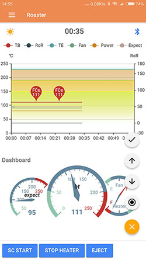
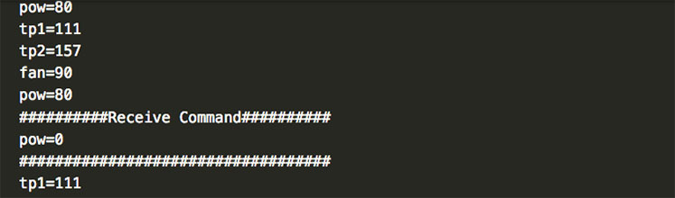

# Poproaster test
Arduino程序，用来测试Android/iOS的应用：`PopRoast`  
**PopRoast**：通过蓝牙接收咖啡烘培时的数据，实时绘制烘培曲线，便于监控烘培情况。  
也可简单录入温度来生成烘培曲线。  
 
# app-bluetooth-test
该Arduino程序产生测试数据，通过蓝牙模块发送到手机上的`PopRoast`应用。
可在Arduino的串口监视器上查看传送的数据。接收应用发送的命令字符串，并显示在串口监视器上。
这个程序仅用于测试。


# poproast-demo
使用MAX31855模块测量温度，并通过蓝牙模块发送到手机上的`PopRoast`应用  


# Install
Just clone and install to your Arduino uno with bluetooth and MAX31855 modules.
[poproaster-test](https://github.com/usb2win/poproaster-test)
:tada:

 * 如果喜欢它，请别忘了给我一颗鼓励的星
 * Support me a `Star` if it is necessary.  :+1:

# poproast-demo使用要求
如果您要使用PopRoast来查看烘培曲线，您可能需要：
1. Arduino Uno
2. Bluetooth 数据传输模块(hc-05/06 for Android,hc-02 for Android/iOS)
3. MAX31855 温度测量模块  
如果您需要使用Arduino控制咖啡烘培过程，还需要使用PWM来控制风量，使用SSR来控制加热，本程序不包含这些内容。

# PopRoast数据格式
## Arduino发送数据格式：
```
豆温："tp1=xxx\n"
环境温度： "tp2=xxx\n"
温度3: "tp3=xxx\n"
温度4: "tp4=xxx\n"
加热功率："pow=xxx\n", 取值范围: 0 ~ 100(%)
风量："fan=xxx\n", 取值范围: 0 ~ 100(%)
理论温度："expect=xxx\n", 如果使用PID，则为PID的目标温度
```

## `PopRoast`应用发送命令格式：
```
↑ ↓: 风量增减，每按一次发送"fan=xxx\n"，xxx为当前温度加／减1
← →: 用户自定义命令，可在`PopRoast`上设置
确认，停止按钮可在`PopRoast`上设置
注：命令最后会自动加上"\n"
```

# Languages
* 🇨🇳 zh
* 🇺🇸 en 


# Platforms
Arduino only

# License
MIT

# :snowflake: :beers:

* Please let me know if you have any questions.